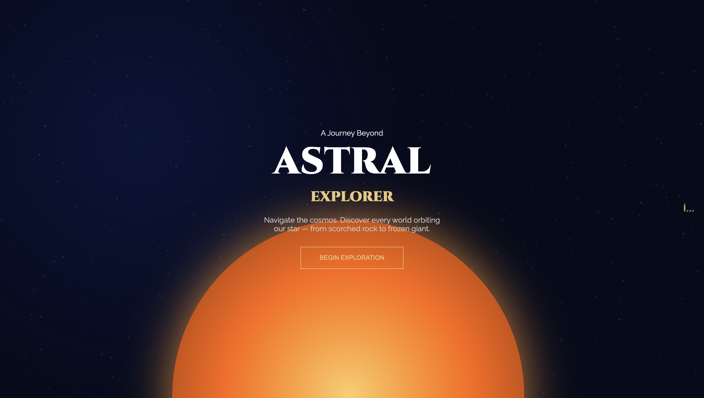
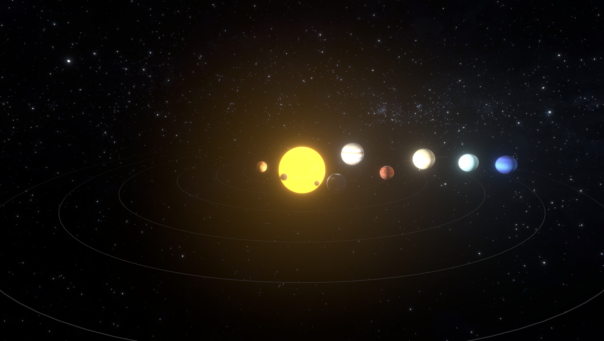
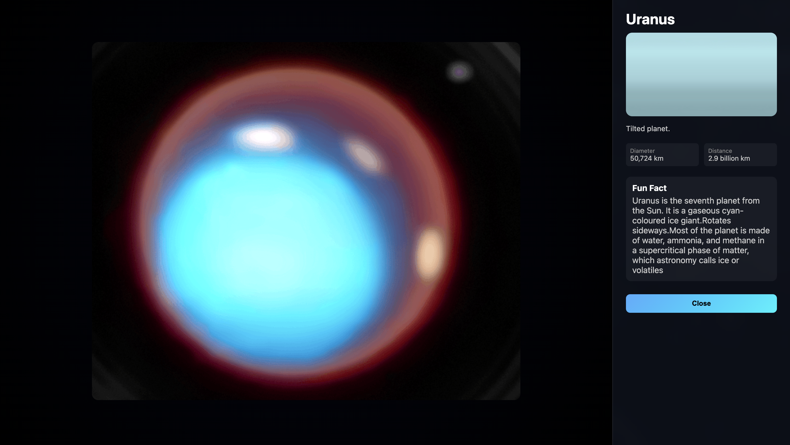

# Astral Explorer

<div align="center">


### An Interactive 3D Solar System Experience Built with React Three Fiber

Explore planets, cinematic transitions, immersive space visuals, and real-time interactions in a stunning web-based universe.


</div>

---

# Table of Contents

* [Overview](#overview)
* [Project Vision](#project-vision)
* [Features](#features)
* [Tech Stack](#tech-stack)
* [Project Architecture](#project-architecture)
* [Folder Structure](#folder-structure)
* [Installation](#installation)
* [Running the Project](#running-the-project)
* [Core Functionalities](#core-functionalities)
* [Planet System](#planet-system)
* [Camera & Cinematic Effects](#camera--cinematic-effects)
* [Animations](#animations)
* [Performance Optimizations](#performance-optimizations)
* [UI Components](#ui-components)
* [Future Enhancements](#future-enhancements)
* [Screenshots](#screenshots)
* [Learning Outcomes](#learning-outcomes)
* [Challenges Faced](#challenges-faced)
* [Contributing](#contributing)
* [License](#license)
* [Author](#author)

---

# Overview

**Astral Explorer** is a highly immersive interactive 3D Solar System experience developed using **React Three Fiber** and **Three.js**.

The project allows users to:

* Explore planets in real time
* Click planets to zoom into them
* View detailed information panels
* Experience cinematic transitions
* Pause and resume orbital animations
* Interact with a fully animated space environment
* Experience realistic scaling, lighting, and planetary movement

The objective of this project is to combine:

* Space visualization
* Real-time 3D rendering
* Interactive UI/UX
* Scientific exploration
* Modern web technologies

into one seamless futuristic application.

---

# Project Vision

Astral Explorer was designed to create an educational yet visually stunning simulation of the Solar System.

Instead of static learning interfaces, the project aims to deliver:

* A cinematic space exploration experience
* Interactive learning through visualization
* Realistic planetary movements
* Smooth user-controlled navigation
* Modern web-based 3D graphics

The project demonstrates how modern frontend technologies can be used to create advanced immersive applications directly in the browser.

---

# Features

## Core Features

* Fully interactive 3D Solar System
* Realistic planetary rotation
* Planet orbit animations
* Dynamic lighting system
* Responsive camera controls
* Smooth zoom transitions
* Click-to-focus planets
* Information panels for each planet
* Pause/Resume animation controls
* Space-themed immersive UI
* Responsive design
* High-performance rendering

## Advanced Features

* Cinematic camera movement
* Planet preview component
* Real-time orbital motion
* Atmospheric glow effects
* Texture mapping
* Scalable component architecture
* Reusable 3D components
* Smooth interpolation animations

---

# Tech Stack

| Technology | Purpose |
|---|---|
| React | Frontend framework |
| React Three Fiber | 3D rendering with React |
| Three.js | Core 3D engine |
| Vite | Fast build tool |
| JavaScript | Application logic |
| Tailwind CSS | Styling |
| Drei | Useful helpers for R3F |
| Framer Motion | UI animations |

---

# Project Architecture

Astral Explorer follows a modular architecture where each major system is separated into reusable components.

## Architecture Layers

```text
User Interface Layer
        ↓
React Components
        ↓
React Three Fiber Scene
        ↓
Three.js Rendering Engine
        ↓
WebGL Rendering
```

## Major Systems

### 1. Scene Management

Handles:

* Lighting
* Environment setup
* Background space rendering
* Camera initialization

### 2. Planet Engine

Responsible for:

* Planet creation
* Rotation
* Orbit calculations
* Texture loading
* Scaling

### 3. Camera Controller

Controls:

* Zoom transitions
* Focus animations
* User navigation
* Cinematic movements

### 4. Information System

Displays:

* Planet details
* Statistics
* Descriptions
* Dynamic UI updates

---

# Folder Structure

```bash
Astral-Explorer/
│
├── public/
│   ├── favicon.svg
│   └── icons.svg
│
├── src/
│   ├── assets/
│   ├── App.css
│   ├── App.jsx
│   ├── IntroScreen.css
│   ├── IntroScreen.jsx
│   ├── PlanetInfo.css
│   ├── PlanetInfo.jsx
│   ├── SolarSystem.jsx
│   ├── index.css
│   └── main.jsx
│
├── interface-interface.png
├── ui-UI.png
├── another ui-UI7.png
│
├── .gitignore
├── package.json
├── vite.config.js
└── README.md
```

## Important Files Explained

| File | Purpose |
|---|---|
| App.jsx | Main application component |
| SolarSystem.jsx | Handles 3D solar system rendering and planet logic |
| PlanetInfo.jsx | Displays selected planet information panel |
| IntroScreen.jsx | Intro landing screen before entering the experience |
| main.jsx | React application entry point |
| App.css | Global app styling |
| PlanetInfo.css | Styling for planet information panel |
| IntroScreen.css | Styling for intro screen |
| index.css | Base global styles |
| assets/ | Stores textures, images, and static resources |

---

# Installation

## Clone the Repository

```bash
git clone https://github.com/your-username/astral-explorer.git
```

## Navigate to Project Folder

```bash
cd astral-explorer
```

## Install Dependencies

```bash
npm install
```

---

# Running the Project

## Start Development Server

```bash
npm run dev
```

## Build for Production

```bash
npm run build
```

## Preview Production Build

```bash
npm run preview
```

---

# Core Functionalities

# 1. Planet Rendering

Each planet is rendered using:

* Sphere geometries
* High-quality textures
* Rotation animations
* Orbital calculations
* Dynamic scaling

Example:

```jsx
<mesh rotation={[0, 0, 0]}>
  <sphereGeometry args={[1, 64, 64]} />
  <meshStandardMaterial map={earthTexture} />
</mesh>
```

---

# 2. Orbital Motion

Planets revolve around the sun using trigonometric calculations.

Features:

* Dynamic orbital speed
* Circular orbital paths
* Real-time animation updates
* Adjustable orbit radius

---

# 3. Interactive Planet Selection

Users can click planets to:

* Zoom into the planet
* Focus the camera
* Display detailed information
* Trigger cinematic transitions

Example:

```jsx
onClick={() => focusPlanet("Earth")}
```

---

# 4. Information Panels

Displays:

* Planet name
* Distance from sun
* Diameter
* Atmosphere
* Interesting facts
* Rotation period
* Orbital period

---

# Planet System

## Included Celestial Bodies

* Sun
* Mercury
* Venus
* Earth
* Mars
* Jupiter
* Saturn
* Uranus
* Neptune

Optional future additions:

* Pluto
* Asteroid belt
* Moons
* Space stations
* Comets
* Black holes

---

# Camera & Cinematic Effects

Astral Explorer includes advanced cinematic movement systems.

## Features

* Smooth interpolation
* Focus transitions
* Dynamic zooming
* Auto-follow camera
* Rotation tracking
* Planet-centered navigation

## Camera Techniques Used

### Linear Interpolation (LERP)

Used for:

* Smooth camera motion
* Transition animations
* Dynamic positioning

### Orbit Controls

Provides:

* User interaction
* Rotation control
* Zoom control
* Pan control

---

# Animations

The application includes multiple real-time animations.

## Planet Animations

* Self rotation
* Orbital revolution
* Atmospheric movement
* Floating effects

## UI Animations

* Fade transitions
* Sliding panels
* Interactive hover effects
* Dynamic loading animations

---

# Performance Optimizations

To ensure smooth rendering, multiple optimizations were implemented.

## Optimization Techniques

### Texture Optimization

* Compressed textures
* Efficient texture loading
* Reduced memory usage

### Rendering Optimization

* Reusable geometries
* Reduced draw calls
* Optimized lighting
* Efficient animation loops

### React Optimization

* Component reusability
* Memoization
* Lazy loading
* State optimization

---

# UI Components

## PlanetPreview Component

The PlanetPreview component provides:

* Planet showcase cards
* Preview animations
* Highlighted planet details
* Presentation-ready visuals

## Control Panel

Includes:

* Pause/Resume controls
* Camera reset
* Planet navigation
* Orbit toggles
* UI settings

---

# Future Enhancements

## Planned Features

* AI-powered narration
* Voice controls
* Multiplayer exploration
* VR compatibility
* Procedural galaxies
* NASA API integration
* Space missions mode
* Realistic physics engine
* Dynamic asteroid systems
* Black hole simulations

---

# Screenshots

## Intro Experience

The project begins with a cinematic landing screen introducing users to the Astral Explorer universe.



Features shown:

* Cinematic UI
* Space-themed landing page
* Begin Exploration interaction
* Animated cosmic background

---

## Full Solar System View

Users can explore the entire solar system with realistic orbital layouts and glowing planetary rendering.



Features shown:

* Realistic orbital rings
* Dynamic planetary glow
* 3D rendering environment
* Space background simulation
* Real-time planetary positioning

---

## Planet Information Interface

Clicking a planet opens an immersive information panel containing facts and planetary statistics.



Features shown:

* Planet details panel
* Interactive close button
* Planet statistics
* Modern glassmorphism UI
* Dynamic content rendering

---

# Learning Outcomes

This project helped in understanding:

* 3D graphics rendering
* React Three Fiber architecture
* Three.js fundamentals
* Real-time animation systems
* Camera mathematics
* Interactive UI/UX design
* Performance optimization
* Component-driven architecture
* WebGL rendering concepts

---

# Challenges Faced

## 1. Managing 3D Performance

Rendering multiple animated objects simultaneously required:

* Optimization strategies
* Efficient rendering pipelines
* Careful texture management

## 2. Smooth Camera Transitions

Achieving cinematic movement involved:

* Position interpolation
* Rotation synchronization
* Dynamic target tracking

## 3. Planetary Scaling

Maintaining realistic visuals while preserving usability required balancing:

* Accuracy
* Visibility
* Performance

---

# Contributing

Contributions are welcome.

## Steps to Contribute

1. Fork the repository
2. Create a new branch
3. Commit your changes
4. Push the branch
5. Open a Pull Request

---

# License

This project is licensed under the MIT License.

---

# Author

## Developed By

**Your Name**

Passionate about:

* 3D Web Development
* Space Visualization
* Interactive UI/UX
* Modern Frontend Engineering

---

# Support

If you like this project:

* Star the repository
* Share the project
* Contribute improvements
* Report issues

---

<div align="center">

## Astral Explorer

### "Explore the Universe from Your Browser"

</div>
